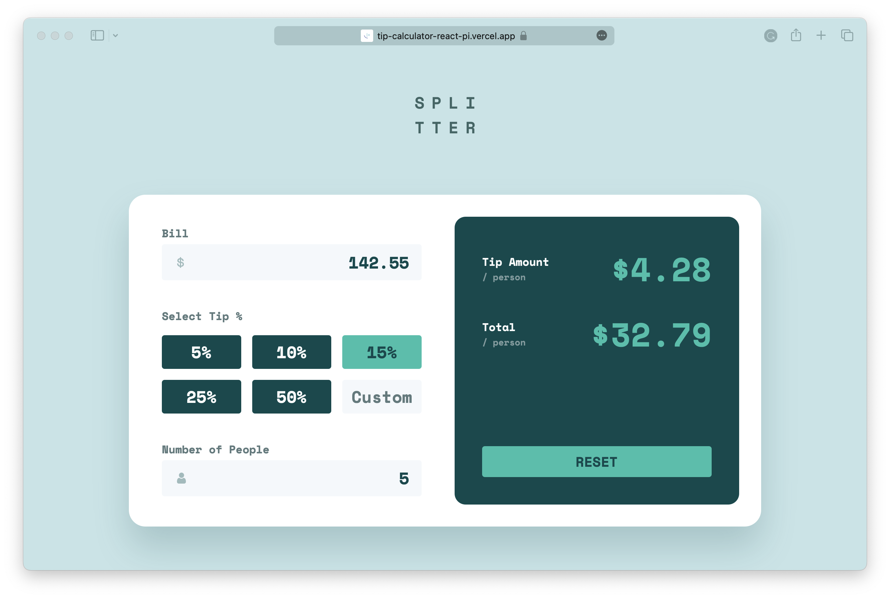

# Frontend Mentor - Tip calculator app solution

This is a solution to the [Tip calculator app challenge on Frontend Mentor](https://www.frontendmentor.io/challenges/tip-calculator-app-ugJNGbJUX). Frontend Mentor challenges help you improve your coding skills by building realistic projects.

## Table of contents

- [Overview](#overview)
  - [The challenge](#the-challenge)
  - [Screenshot](#screenshot)
  - [Links](#links)
- [Built with](#built-with)
- [How to run](#how-to-run)

## Overview

### The challenge

Users should be able to:

- View the optimal layout for the app depending on their device's screen size
- See hover states for all interactive elements on the page
- Calculate the correct tip and total cost of the bill per person

### Screenshot

### Links

- Solution URL: [code](https://github.com/brunopistarino/tip-calculator-react)
- Live Site URL: [demo](https://tip-calculator-react-pi.vercel.app/)

## Built with

- [React](https://reactjs.org/) - JS library
- [Vite](https://vitejs.dev/) - Build tool
- [Sass](https://sass-lang.com/) - For styles

## How to run

1. Clone or download the repository.
2. Install dependencies with `npm install`.
3. Run the project with `npm run dev`.
4. Open the link in your browser to see the result.
